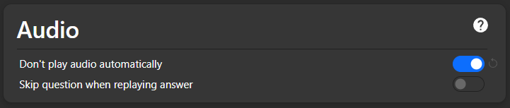
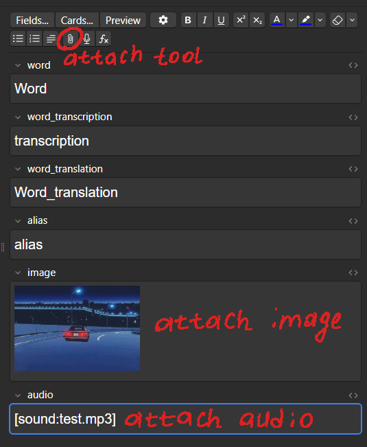
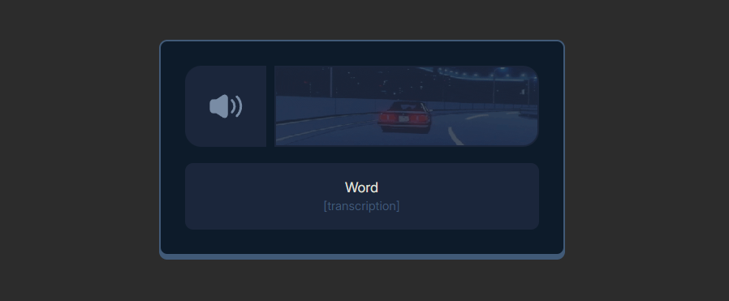
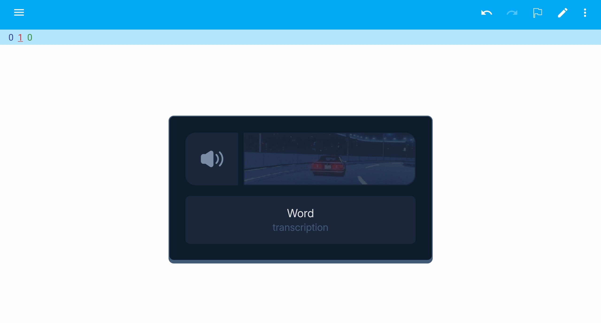
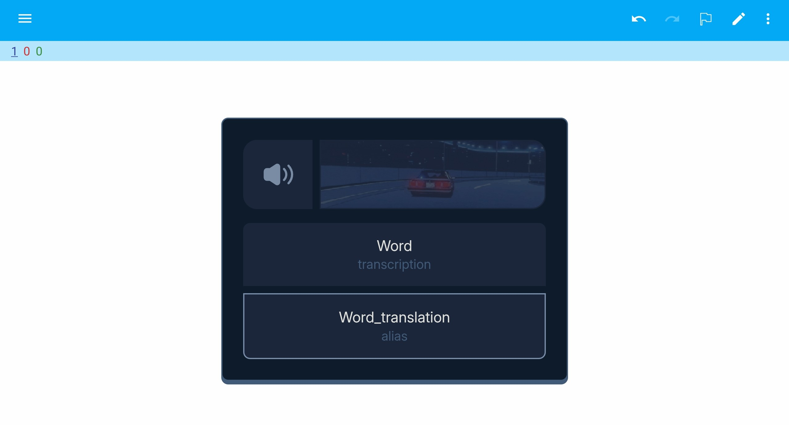
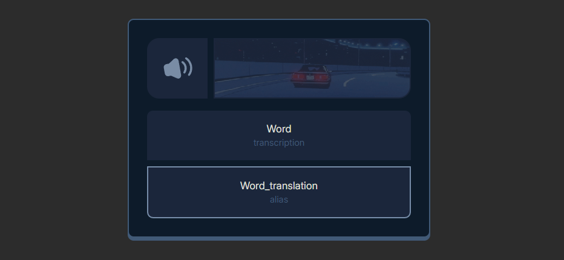

## Dependencies 

Download [Anki](https://apps.ankiweb.net/) to apply Arti.

## Quickstart 

> If you want to set a prettier background, you can install the Anki addon called [Custom Background Image and Gear Icon](https://ankiweb.net/shared/info/1210908941).

All you need to do is to move the _/media_ folder to the absolute path _%appdata%\\Anki2\\User 1\\collection.media_ (you can access it with the hotkey _Win + R_). After that you are ready to make a Basic Anki template using presets in the _/template_ and _/color_schemes_ folders. Otherwise, just import _test.apkg_ with _front.html_, _back.html_, _style.css_ configured.

### Customize
The _/color_schemes_ directory contains different themes with different color variables. To make another theme, adjust _--color(0-4)_.

**Don't forget to turn off the auto-play in your deck settings to prevent your ears from the harmful damage!**

## Fields 

## Examples 

### Front (PC)

### Front (AnkiDroid)

### Back (PC)

### Back (AnkiDroid)

### Back (Hovering)

