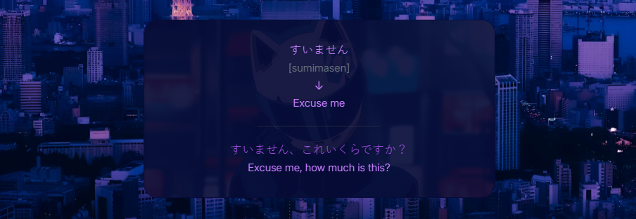
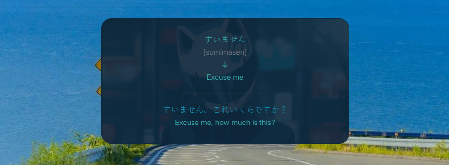

You can find there a fully customable and minimalistic Anki deck created using HTML / CSS. It offers you the basic functionality to feel your studies more comfortable and easier (sometimes)!

## Installation guide

First of all, you need to install the Anki addon called [1210908941](https://ankiweb.net/shared/info/1210908941). It is used to change your background with a custom image. There are some of them in the _/background_ directory.

Secondly, find several images (or even gifs) and move them to the _/media_ directory. After that rename those images according to the rules: the front-sided image gets _\_front-img.*_ and the back-sided image gets _\_back-img.*_; back-img can be considered as a loading card animation while you are choosing the right answer but front-img is an unique value. So, if you want to reach the thing where every card has a personal image on its back side, add the same amount of front-imgs to the _/media_ directory (you change what to play on the both sides later). After all preparations has been made, you need to transfer the _/media_ folder to the path _%appdata%\\Anki2\\User\\collection.media_.

## Examples

### Purple and Pink

### Blue and Green

